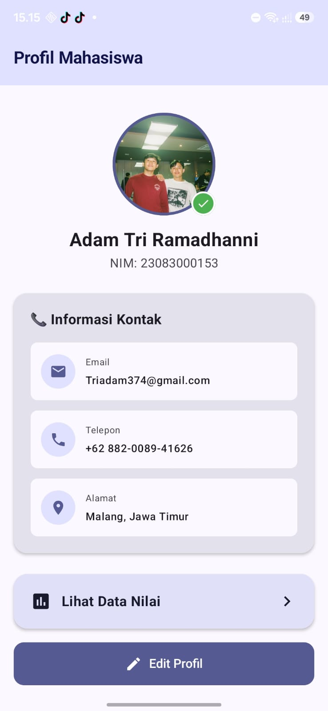
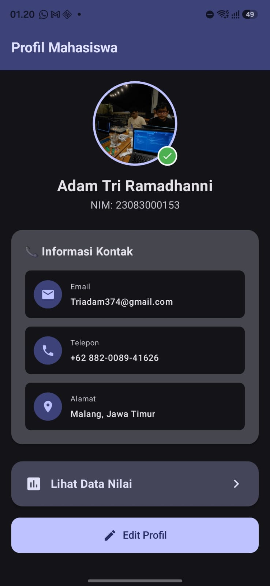

# 📱 Week 2 - Jetpack Compose Fundamentals
## Praktikum: Aplikasi Profil Mahasiswa

---

## 🎯 Tujuan Pembelajaran

Setelah menyelesaikan praktikum ini, mahasiswa mampu:
1. Memahami perbedaan paradigma **Imperatif** (XML) vs **Deklaratif** (Compose)
2. Membuat dan memanggil fungsi **@Composable**
3. Menggunakan layout dasar: **Column**, **Row**, **Box**
4. Menerapkan **Modifier** untuk styling (padding, background, border, size)
5. Mengelola **State** dengan `remember` dan `mutableStateOf`
6. Menggunakan komponen **Material 3**: Card, Button, Scaffold, TopAppBar
7. Membuat **@Preview** untuk melihat UI di Android Studio

---

## 📁 Struktur Project

```
Week2_ProfilMahasiswa/
├── app/
│   ├── build.gradle.kts          ← Konfigurasi dependencies
│   └── src/main/
│       ├── AndroidManifest.xml    ← Manifest aplikasi
│       ├── java/com/example/profilmahasiswa/
│       │   ├── MainActivity.kt    ← Entry point
│       │   ├── screens/
│       │   │   └── ProfileScreen.kt  ← ⭐ UI UTAMA (file terpenting!)
│       │   └── ui/theme/
│       │       └── Theme.kt       ← Konfigurasi warna & tema
│       └── res/values/
│           └── themes.xml
├── build.gradle.kts               ← Project-level config
├── settings.gradle.kts
└── gradle/libs.versions.toml      ← Version catalog
```

---

## 🔑 Konsep Kunci yang Dipelajari

### 1. @Composable Function
```kotlin
@Composable
fun Greeting(name: String) {
    Text(text = "Halo, $name!")
}
```
- Anotasi `@Composable` menandai fungsi sebagai builder UI
- Nama fungsi menggunakan **PascalCase**
- Menerima data sebagai parameter

### 2. Layout: Column, Row, Box
- **Column** → Menyusun children **vertikal** (↓)
- **Row** → Menyusun children **horizontal** (→)
- **Box** → **Menumpuk** children (stack/overlap)

### 3. Modifier (Rantai Styling)
```kotlin
Modifier
    .fillMaxWidth()          // Sizing
    .padding(16.dp)          // Spacing
    .background(Color.Gray)  // Visual
    .clickable { }           // Interaction
```
**Penting:** Urutan modifier berpengaruh! padding → background ≠ background → padding

### 4. State & Recomposition
```kotlin
var count by remember { mutableStateOf(0) }
// Saat count berubah → Compose re-render UI yang terpengaruh
```

### 5. @Preview
```kotlin
@Preview(showBackground = true, showSystemUi = true)
@Composable
fun PreviewScreen() {
    MyScreen()
}
```
Memungkinkan melihat UI **tanpa** menjalankan emulator.

---

## 🚀 Cara Menjalankan

1. Buka **Android Studio**
2. Pilih **File → Open** → pilih folder `Week2_ProfilMahasiswa`
3. Tunggu Gradle sync selesai
4. Klik **Run** (▶) atau `Shift+F10`
5. Untuk melihat Preview: buka `ProfileScreen.kt` → klik tab **"Split"** atau **"Design"**

---

## ✏️ Tugas Mandiri

Modifikasi project ini dengan menambahkan:

1. **Data diri Anda** — ganti nama, NIM, jurusan, email, telepon
2. **Hobby section** — tambahkan Card baru dengan daftar hobby Anda
3. **Foto profil** — ganti placeholder icon dengan foto asli dari drawable
4. **Tombol share** — tambahkan OutlinedButton untuk share profil
5. **Dark mode toggle** — tambahkan switch untuk berganti tema


## 📚 Referensi

- [Jetpack Compose Tutorial (Android Developers)](https://developer.android.com/jetpack/compose/tutorial)
- [Compose Layout Basics](https://developer.android.com/jetpack/compose/layouts/basics)
- [State and Compose](https://developer.android.com/jetpack/compose/state)
- [Material 3 Components](https://developer.android.com/jetpack/compose/designsystems/material3)

<h2>Hasil Tampilan Aplikasi</h2>

<p align="center">
  
  
  
    
</p>
